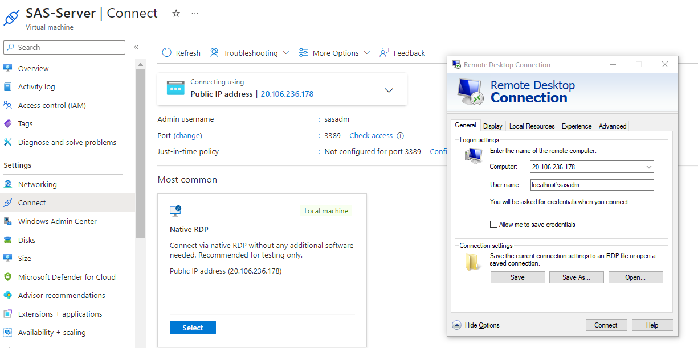

### Connect to your Virtual Machine using Remote Desktop Connection
Alternately, use any RDP emulation package.  There are many available such as MobaXterm, but MS Remote Desktop Connection is part of any Windows desktop or server OS.
1. Locate the IP address that was assigned to your new SAS-Server instance.  Look in the Azure Portal for a Virtual Machine named **SAS-Server**.   Select it and then go the the **Connect** settings.
Note the **Public IP** address there for Step 3.
3. Go to Start on your desktop and locate the **Remote Desktop Connection** utility.
4. In the General tab provide the following:
	* Computer: **<the IP address found in step 1>**
	* User name:  **localhost\sasadm**
	* Check "Allow me to save credentials"
5. Click **Connect**
6. You will be prompted for the sasadm password, which is **letstrySASon!**
<kbd></kdb>
7. Once the server displays, you can exit out of the "Manage Server" screen
8. Open a Powershell window (type **power** on the search bar and then click the Windows PowerShell app displayed in the results)
9. Paste (cntl + v) the commands below and hit **Enter** to create a SAS Server Users group and the 2 required SAS users
```
net user sasdemo Orion123 /add /expires:never /passwordchg:no /fullname:"SAS Demo User"
net user sassrv Orion123 /add /expires:never /passwordchg:no /fullname:"SAS Server Invoker" 
net localgroup "SAS Server Users" /add
net localgroup "SAS Server Users" sasdemo /add
net localgroup "SAS Server Users" sassrv /add 
```
10. Paste the commands below to grant the SAS Server Users group to the local security policy of **Logon as a Batch Job**
```
Install-Module -Name 'Carbon' -AllowClobber
Import-Module 'Carbon'
Grant-CPrivilege -Identity "SAS Server Users" -Privilege SeBatchLogonRight
```
