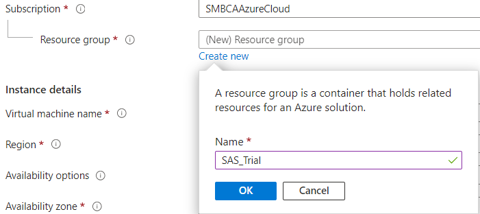
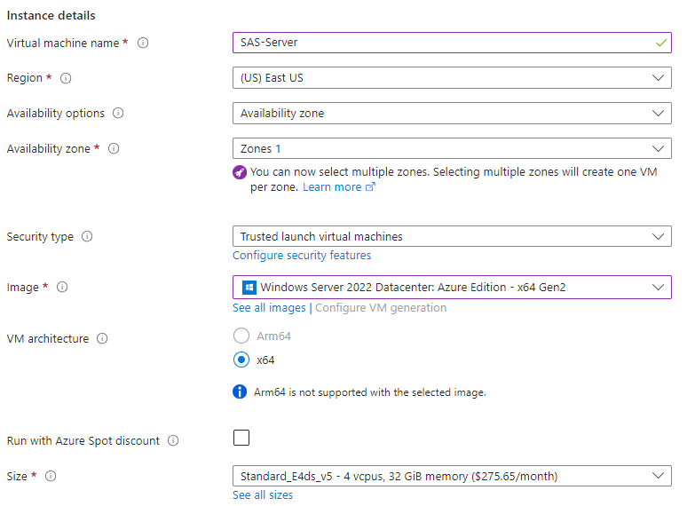

### Create Azure VM environment
1. Login to the [Azure Portal](https://portal.azure.com/#create/Microsoft.VirtualMachine-ARM) **Create a Virtual Machine** page 
2. It is suggested that you create a new Resource Group for your but this is not required if you desire to add them to an existing group

<kbd></kbd>

3. For the Instance Details accept defaults except:
	* Virtual machine name:  **SAS-Server**
	* Image: **Windows Server 2022 Datacenter: Azure Edition - x64 Gen2**
	* User:  **sasadm**
	* Password:  **letstrySASon!**

   :heavy_exclamation_mark: It is strongly suggested that you use these **exact values**, as the scripts that make up this resource have been coded accordingly.  If you chose to deviate, you will have the opportunity to edit the files supplied, but this could lead to deployment failures.

<kbd></kbd>

4. Select **Review+Create**
5. At this point you may select **Create**, or optionally modify before selecting Create
	* Networking:  Delete public IP and NIC when VM is deleted
	* Management:  Auto-shutdown
6. The server created above has a default name and administrator account.  Note these values for future steps, you will need them during the Pre-install tasks:
<table>
  <tr><td>SAS Server Host Name</td><td>SAS-Server</td></tr>
  <tr><td>Installer Account</td><td>sasadm</td></tr>
  <tr><td>Installer Password</td><td>letstrySASon!</td></tr>
</table>
Go to Step 1 [Download the SAS Software Depot](Download_the_SAS_Software_Depot.md)
