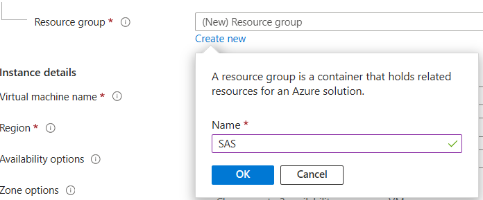

### Create Azure VM environment
1. Login to the [Azure Portal](https://portal.azure.com/#create/Microsoft.VirtualMachine-ARM) **Create a Virtual Machine** page 
2. It is suggested that you create a new Resource Group for your but this is not required if you desire to add them to an existing group

<kbd></kbd>

3. For the Instance Details, select common defaults unless your organization requires specific aspects.  You need to determine values for:
	* Virtual machine name
	* Image: Recommended **Windows Server 2022 Datacenter: Azure Edition - x64 Gen2**
        * Instance:  Recommended **E8ds_v5** or the instance from your server sizing results
	* Administrator User:  Recommended **sasadm**
	* Administrator Password:  Set and remember ;)

<kbd></kbd>

4. Select **Review+Create**
5. At this point you may select **Create**, or optionally modify before selecting Create
	* Networking:  Delete public IP and NIC when VM is deleted
	* Management:  Auto-shutdown

Go to Step 1 [Download the SAS Software Depot](Download_the_SAS_Software_Depot.md)
