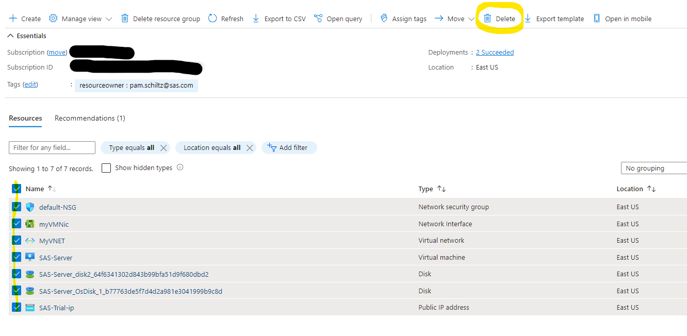

### Deleting the SAS-Server resources

If you have completed your trial and want to remove the SAS deployment resources, follow these steps within the [Azure Portal](http://portal.azure.com):

Option 1:  Delete the entire resource group if you created one specifically for this trial
Option 2:  Delete the 7 resources from your resource group associated with the SAS trial environment

