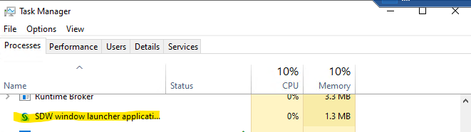

### Deploy and Configure SAS Software

This GitHub project contains a response file that was previously recorded from an installation of SAS Visual Analytics, SAS Visual Statistics, SAS/STAT, and SAS Enterprise Guide to a Windows Server.  You will download and use this recorded response file in order to remove all prompting from the SAS installation process.  Through PS commands, you will be able to edit the response file with any specific values that are unique to your environment.

1.  Download the response file stored in this GitHub repository.  This file will be edited using environment variables set in future steps.  This response file will feed these values to the SAS Deployment Wizard.  Edit the depot path if you did not select the default during your download.
```
$Env:sas_depot='c:\sas software depot'
wget -outfile "$Env:sas_depot\sdwresponse.properties" https://pschiltz.github.io/VisAnVisStat/planvavs.properties
```
2.  Create environment variables to store the values for your specific settings.  Set all of these variables, even if you are taking the default values.  These will be used to edit the response file and invoke the SAS Deployment Wizard.
      * Define your configuration directory.  This directory will be created during the install.  
      ```
      $Env:sas_config='C:\SAS\Config'
      ```
      * Define your SAS Home directory.  This directory will be created for you. 
      ```
      $Env:sashome_path='C:\Program Files\SASHome'
      ```
      * Define the host name of your server.  This can be the IP address, short, or fully qualified name.  
      ```
      $Env:SAS_Server='localhost'
      ```
      * Define the installer account, the account that you are currently logged in as.  (This account is created while reserving a cloud-based VM)  
      ```
      $Env:installer_account='<your installer account>'
      ```
      * Define the password of the installer account. 
      ```
      $Env:install_pass='<your installer account password>'
      ```
      * Define a password to set for your internal SAS accounts, including the SAS Administrator account, that are created during the configuration.  Example:```  $Env:sas_internal_pass='Orion123'```
      ```
      $Env:sas_internal_pass='<provide a password for your internal SAS accounts>'
      ```
      
3.  Make substitutions in the response file using the environment variables set above.  You should not have to edit this code.
```
(Get-Content $Env:sas_depot\sdwresponse.properties) -replace 'SAS-Server', $Env:SAS_Server | Set-Content $Env:sas_depot\sdwresponse.properties
(Get-Content $Env:sas_depot\sdwresponse.properties) -replace 'sas_depot', $Env:sas_depot | Set-Content $Env:sas_depot\sdwresponse.properties
(Get-Content $Env:sas_depot\sdwresponse.properties) -replace 'sas_config', $Env:sas_config | Set-Content $Env:sas_depot\sdwresponse.properties
(Get-Content $Env:sas_depot\sdwresponse.properties) -replace 'installer_account', $Env:installer_account | Set-Content $Env:sas_depot\sdwresponse.properties
(Get-Content $Env:sas_depot\sdwresponse.properties) -replace 'install_pass', $Env:install_pass | Set-Content $Env:sas_depot\sdwresponse.properties
(Get-Content $Env:sas_depot\sdwresponse.properties) -replace 'sas_internal_pass', $Env:sas_internal_pass | Set-Content $Env:sas_depot\sdwresponse.properties
(Get-Content $Env:sas_depot\sdwresponse.properties) -replace 'sassrv_pass', $Env:sassrv_pass | Set-Content $Env:sas_depot\sdwresponse.properties
(Get-Content $Env:sas_depot\sdwresponse.properties) -replace 'junit_path', $Env:junit_path | Set-Content $Env:sas_depot\sdwresponse.properties
(Get-Content $Env:sas_depot\sdwresponse.properties) -replace 'sashome_path', $Env:sashome_path | Set-Content $Env:sas_depot\sdwresponse.properties
(Get-Content $Env:sas_depot\sdwresponse.properties) -replace 'python_path', $Env:python_path | Set-Content $Env:sas_depot\sdwresponse.properties
```
   
4.  Execute the install:  
```
copy "$Env:sas_depot\sid_files\sas*.txt" "$Env:sas_depot\sid_files\sid.txt"
& "$Env:sas_depot\setup.exe" -quiet -wait -responsefile "$Env:sas_depot\sdwresponse.properties"
```
The command will execute and return.  But the install and configuration will take approximately 60 minutes.  You can monitor the **SDW window launcher application** process in Task Manager to determine if it is still running.  You can also watch for the population of your SAS installation and configuration directories.
   


**Congratulations!**  Your SAS Deployment is complete and you are ready to start using **SAS Office Analytics**.
Suggested next steps:
* [Add Users](Add_Users.md)
* [Tour the Environment](Environment_Overview.md)
* [Login to SAS Enterprise Guide](Enterprise_Guide.md)
  

